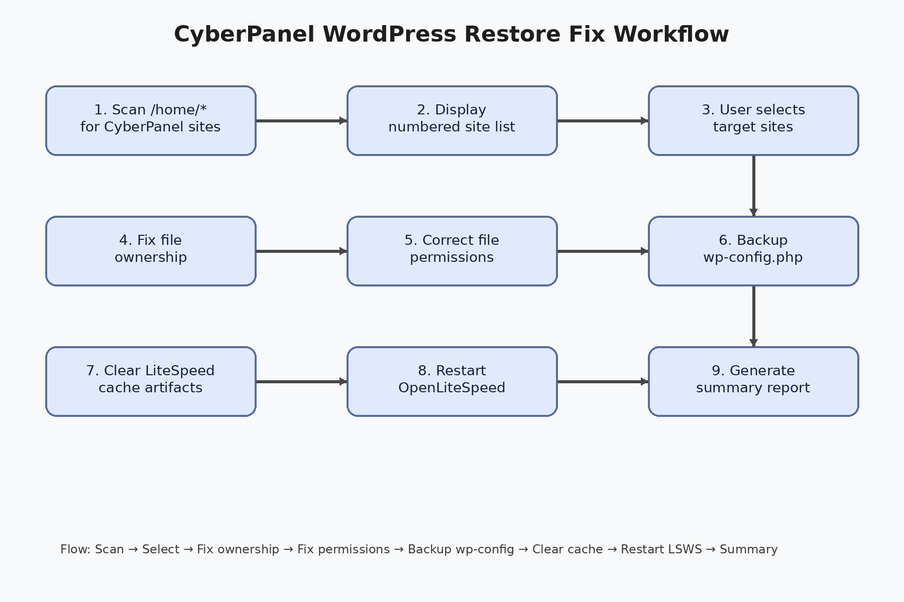
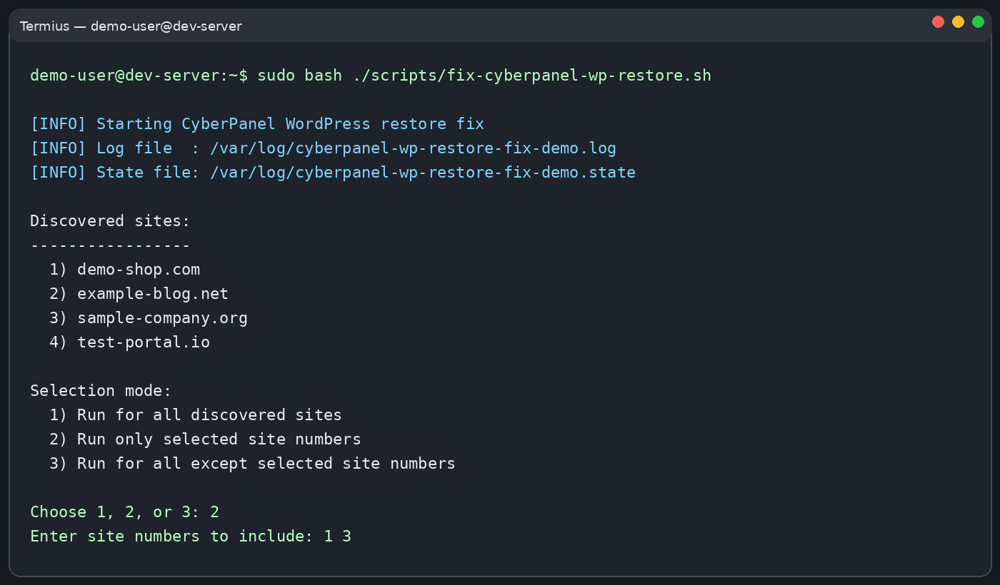
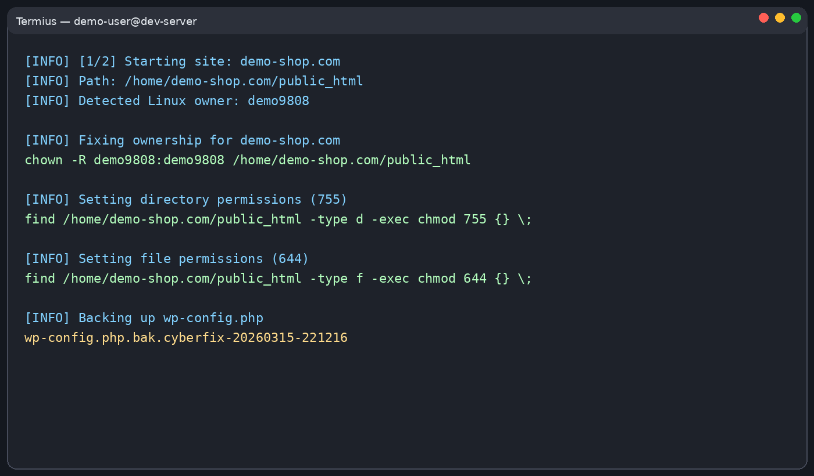
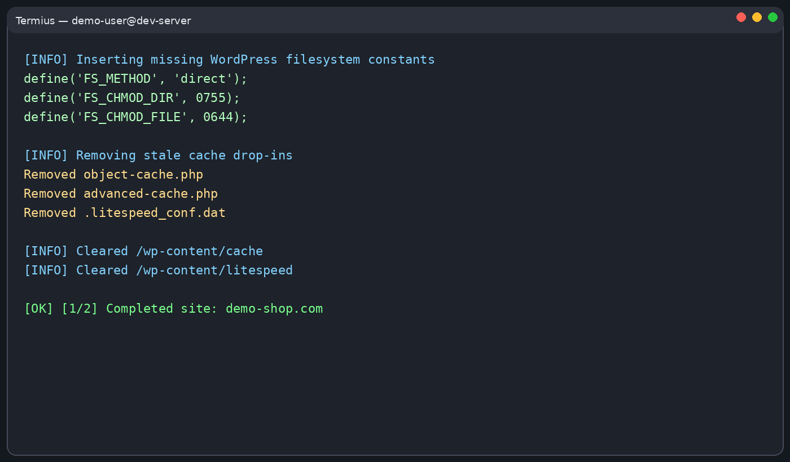
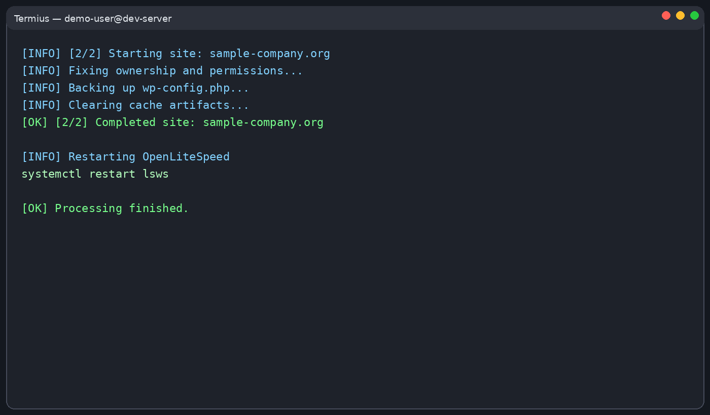
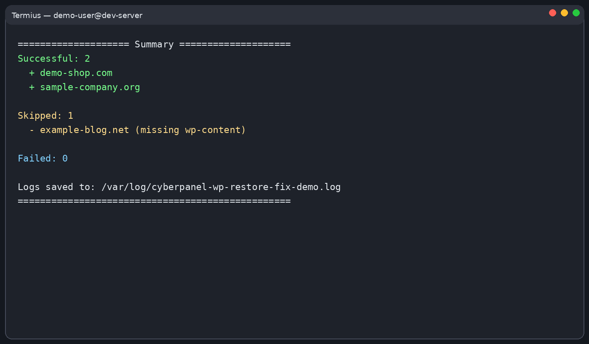

# CyberPanel WordPress Restore Fix


A utility script to fix **WordPress restore permission issues on CyberPanel servers** running OpenLiteSpeed.

> Fixes the original issue discussed here:  
> <https://github.com/usmannasir/cyberpanel/issues/1735>

---

## Overview

When WordPress sites are restored from backups on CyberPanel servers, file ownership and permissions may become inconsistent. This can lead to:

- WordPress asking for **FTP credentials**
- Plugins/themes failing to install
- Media uploads failing
- LiteSpeed Cache initialization errors
- Object cache issues

This project automates the process of fixing those problems safely.

---

## Workflow



Process:

1. Scan `/home/*` for CyberPanel domains
2. List sites in numbered format
3. Let the user choose targets
4. Fix ownership
5. Fix permissions
6. Backup `wp-config.php`
7. Clear LiteSpeed cache artifacts
8. Restart OpenLiteSpeed
9. Print a summary report

---

## Features

- Safe ownership repair
- Automatic permission correction
- `wp-config.php` backup before modification
- Dry-run mode
- Interactive site selection
- Multi-site support
- Rollback script included
- Works with large multi-site servers
- Verbose logging and state tracking
- Summary report at completion

---

## Screenshots

### Site discovery


### Processing site


### Cache cleanup


### Restarting OpenLiteSpeed


### Final summary


---

## Installation

Clone the repository:

```bash
git clone https://github.com/areez/cyberpanel-2.4.x-wp-restore-fix.git
cd cyberpanel-2.4.x-wp-restore-fix
chmod +x scripts/*.sh
```

---

## Usage

Run the script:

```bash
sudo bash ./scripts/fix-cyberpanel-wp-restore.sh
```

If you want to use the executable bit and shebang directly:

```bash
sudo chmod +x ./scripts/fix-cyberpanel-wp-restore.sh
sudo ./scripts/fix-cyberpanel-wp-restore.sh
```

---

## Dry Run Mode

```bash
DRY_RUN=1 sudo bash ./scripts/fix-cyberpanel-wp-restore.sh
```

---

## Run for One Domain

```bash
DOMAIN=example.com sudo bash ./scripts/fix-cyberpanel-wp-restore.sh
```

---

## CLI Examples

Run non-interactively for all sites:

```bash
sudo bash ./scripts/fix-cyberpanel-wp-restore.sh --yes
```

Run only selected site numbers:

```bash
sudo bash ./scripts/fix-cyberpanel-wp-restore.sh --yes --sites 1,2,5
```

Run all except selected site numbers:

```bash
sudo bash ./scripts/fix-cyberpanel-wp-restore.sh --yes --exclude 3,4
```

---

## Rollback

If you need to revert `wp-config.php` changes:

```bash
sudo bash ./scripts/restore-wp-config-backups.sh
```

---

## Logs

Execution logs are stored in:

```bash
/var/log/cyberpanel-wp-restore-fix-*.log
```

State files are stored in:

```bash
/var/log/cyberpanel-wp-restore-fix-*.state
```

---

## Warning

- Run this script **as root**
- Always test on **one domain first** if running on production servers
- The rollback script restores **only `wp-config.php`**
- If the script is interrupted, re-run for the affected site only with `DOMAIN=...`

---

## Compatibility Note

This script uses **Bash-specific syntax**. If your system defaults `/bin/sh` to `dash`, run the scripts with `bash`:

```bash
sudo bash ./scripts/fix-cyberpanel-wp-restore.sh
```

---

## Author

**Areez Afsar Khan**  
*Entrepreneur, DevOps Practitioner & Founder of Valiant Technologies*

[https://valiant.com.bd](https://valiant.com.bd) | [https://areezafsar.com](https://areezafsar.com) | [hello@areezafsar.com](mailto:hello@areezafsar.com) | [connect@wervaliant.com](mailto:connect@wervaliant.com)

---

## License

MIT License

This project is **free to use, modify, and distribute**.
